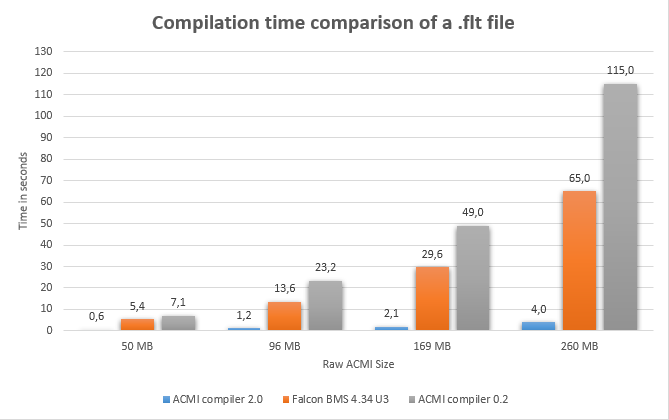

# ACMI-Compiler

### Table of content
- [What is this ?](#what-is-this--)
- [What are the requirement ?](#what-are-the-requirement--)
- [Why should I use this program ?](#why-should-i-use-this-program--)
- [Download and usage](#cool---how-do-i-use-it--)
- [Performances](#performances)
- [Sidenotes](#sidenotes)
- [Modifications to the original code](#modifications-to-the-original-code)
- [Things be aware if you want to modify this code](#things-be-aware-if-you-want-to-modify-this-code)
- [Special thanks](#special-thanks)
- [Official topic on Benchmarksim](#official-topic-on-benchmarksim)

## What is this ?

This program is useful to 
- Prevent any wait between the end of your flight and the Debriefing.
- Stops the compling of ACMI through the Falcom BMS internal compiler s(o immediate return to debrief even with huge acmi recordings.)
- Compile .flt files into .vhs file when you chose to do so.

.flt files are created and filled on the fly by Falcon (whether it's falcon BMS or FreeFalcon) and they are compiled into more readable .vhs files right after exiting the 3D environment and before debriefing. 
The flt file is then deleted and you're left with a .vhs file that you can put into Falcon ACMI viewer (if you hate yourself) or Tacview.

The point of this whole program is to prevent any issue with the ACMI compilation by Falcon by snatching the file from Falcon and allowing you to compile it when *you* want to

## What are the requirement ?

- This program was tested on .flt files from **FreeFalcon 6**, **Falcon BMS 4.33** and **Falcon BMS 4.34** it should however work with pretty much any version of falcon starting from FreeFalcon 6 (Haven't tested anything before that, but the code was really old so ...)

- You should use [**Tacview**](http://www.tacview.net/product/about/en/) to read the .VHS files. The reason for that is that the Falcon ACMI viewer is old, slow and will crash if your .VHS file is too big.

- You need some Free RAM for the compilation / conversion 
  (around 2.5 times the size of the .flt file) So for a 500 MB file you'll need ~1.3 GB of RAM

## Why should I use this program ?

Falcon AVionic Flight Recorder (AVTR) is a really powerful tool that's very helpful for debriefing. 
However, the longer you record, the longer it will take for falcon to convert/compile the .flt file to .vhs (The fixed screen you see when exiting the 3D environment)

This program solve the problem in 2 different ways:

- The program will "steal" .flt files from falcon and rename them into .flt.tmp that way **Falcon will not compile them and you'll be able to access the debriefing immediately**

- The program will wait for your input and then compile the .flt files with all the CPU resources available on your computer

- Also, now the program actually compile faster than BMS 4.34 and 4.33

## Cool ! How do I use it ?

- Download the [**Lastest release**](https://github.com/loitho/acmi-compiler/releases/latest) or [**Direct link**](https://github.com/loitho/acmi-compiler/releases/download/v2.1/acmi-compiler-v2.1.exe)

- Move the .exe file to your ACMI folder (by default: *C:\Falcon BMS 4.34\User\Acmi*)

- **Clear the ACMI Folder of any .flt file**
 
- Run the .exe by double clicking on it. (It must run in the background)

- Start Falcon BMS and play normally, the program will detect new .flt and prevent falcon from converting them

- Once you finished playing and have debriefed, go back to the program window, follow the instruction and the program will convert your files

- You need to keep the CMD window in focus when compiling ACMI, otherwise the compilation will be very long.

## Performances

This picture show the differences in performances between the version 2.0 of the compiler, Falcon BMS 4.34 and the Old compiler version
Specs:  Ryzen 7 3700X 8 cores / 16 Threads - 32 GB of DDR4 RAM / MX100 SSD

## Sidenotes

- The program doesn't care if the ACMI is still recording while leaving the 3D environment (So if you eject and can't stop the recording, the program will prevent BMS from compiling the file anyway)

- The converter/compiler is 10 to 15 times faster than the standard Falcon converter (BMS 4.34.3)

- Yes, it's technically not a compiler it's more like a .flt to .vhs converter 

## Modifications to the original code

So, what did I do ? 

- Changed the pointer lists to Vectors 
- Removed *continue*  that are both slow and make the code less readable
- Removed useless functions that were only here for the ACMI Viewer in Falcon
- Made compilation / conversion consistent (set default value to every structure)
- Added multithreading support 
- Various code optimization 
- Added automatic dectection for new .flt files in the ACMI folder
- Added vector memory reservation for faster file parsing 
- Sorted the vectors so that we can run binary searches in them

## Things be aware if you want to modify this code

- The code was written on Visual Studio 2015 and updated for 2019 (so well, if you have 2019 or newer it sould be good)

- If you're changing the converter/compiler code, download something like [Hashtab](http://implbits.com/products/hashtab/) so you can get a checksum of the VHS files created

- Building in Debug in Visual Studio will make the code slower because VS add a lot of debugging stuff to the vector (it's nearly **25 times slower** ) So use *release* if you want to evaluate your code performance

- The code uses some C++ 11 and C++ 14 features, feel free to use as much recent C++ as you deem necessary to make the compilation faster

- the .licenseheader file comes from a Visual Studio plugin called : [License Header Manager](https://marketplace.visualstudio.com/items?itemName=StefanWenig.LicenseHeaderManager#qna) , you don't need it to do PR or anything, I'm just lazy and it updates headers automatically

## Special thanks

Thanks to this website for putting me on the path to find some falcon source code and an excellent .pdf describing how Falcon changed over the years

https://sites.google.com/site/falcon4sourcecode/

https://github.com/FreeFalcon/freefalcon-central

- Thanks to BibleClinger for putting me on the path to optimize the code even further
- Thanks to Johku for the big ACMI files

## Official topic on Benchmarksim

https://www.benchmarksims.org/forum/showthread.php?32245-Beta-ACMI-compiler&highlight=acmi+compiler

## Future upgrade ?

- Travis-ci for autobuild / check 
- Be able to compile on Linux
- Spawn EC2, upload file, compile, download file, destroy EC2
- GPU calculation ?
